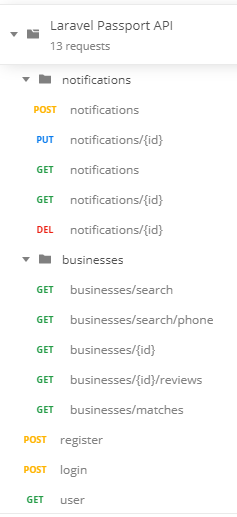

# Laravel Passport API

This project explores the use of [Laravel Framework](https://laravel.com) and [Laravel Passport](https://laravel.com/docs/7.x/passport) to build APIs.

## Use Cases

Main use cases covered:

- [x] Register/login users (should be validated).
- [x] Get current user information (protected route).
- [x] Manage notifications per user (protected routes). A notification has a status: unread/read.
- [x] Seed/fake 100 different users.
- [ ] Use an external API (protected routes).
- [ ] Create a command that clears all notifications for all users.

## Requirements

This project was developed with:

- PHP 7.4.7
- MariaDB 10.1
- Composer 1.10.7

Make sure you have a similar setup to avoid secondary issues.

## First steps

After cloning the project and installing the dependencies (`composer install`), duplicate the `.env.example` file and rename it by `.env`.

Execute the following command to set your application key to a random string:

```sh
php artisan key:generate
```

You should see this message: `Application key set successfully.`, and the APP_KEY value added to your `.env` file.

Run the application:

```sh
php artisan serve
```

and check everything is fine on http://localhost:8000.

### Prepare your database

Update the database parameters (DB_*) accordingly in your `.env` file and execute the migrations:

```sh
php artisan migrate
```

You should see these tables in the database: *failed_jobs*, *migrations*, *oauth_access_tokens*, *oauth_auth_codes*, *oauth_clients*, *oauth_personal_access_clients*, *oauth_refresh_tokens* and *users*.

Install passports by running:

```sh
php artisan passport:install
```

The encryption keys needed to generate secure access tokens will be generated. The "personal access" and "password grant" clients, used to generate access tokens, will also be created.

### Using Postman

[Postman](https://www.postman.com) can be used to test this API. Import the collection and environment in the `/docs` folder (*Laravel Passport API.postman_collection.json* and *Laravel Passport API.postman_environment.json*). You will see these endpoints:



The first steps should be **register** a new user and **login** with it. Note that after login the *access_token* will be set in the environment. This will allow the other endpoints to use that *access_token* without having to do anything else.

### Seeding the database

The following command can be used to seed the database with 100 users:

```sh
php artisan db:seed --class=UsersTableSeeder
```

After this, it will be possible to login with any email generated in the `users` table and the password: `123`.
